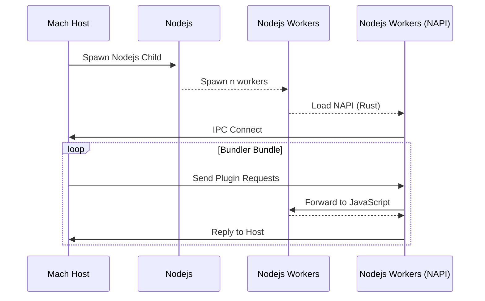

# Blog

## 14 May 2024

**Plugins**

Expanding support for the Parcel plugin API. I have added support for the `loadConfig` methods and migrated the Parcel types across. Most are currently stubbed - but eventually I'll fill out most of the API.

## 12 May 2024

**Plugins**

My focus has been on integrating support for Nodejs plugins into the bundler. 

I have been building an inter-process communication bridge that uses OS specific IPC methods. 

My implementation builds on top of the `ipc_channels` crate that wraps the relevant OS APIs and offers a clean `channel` abstraction to use.

This is very low overhead, though JavaScript plugins will still be slow - Benchmarks are coming.

**How it Works**

Mach spawns a Nodejs child process + Nodejs workers that connect to the Mach host process via a native extension that uses NAPI to transfer Rust types to/from the Nodejs context.

Currently I send the entire request over the wire, in future I may decide to make it "transfer on read" for better performance.

I now need to build out the plugin API with the complete types and forwarding/replying for each request.

I intend to support:

- [Resolvers](https://parceljs.org/features/plugins/#resolvers)
- [Transformers](https://parceljs.org/features/plugins/#transformers)
- [Reporters](https://parceljs.org/features/plugins/#reporters)
- [Namers](https://parceljs.org/features/plugins/#namers)

**What Happened to Deno?**

Deno works but is quite hard to integrate without bringing in a lot of undesirable dependencies. 

It is _super_ fast and supports the Nodejs API which is enabled automatically when Deno detects an import from a package in `node_modules`. 

This has a few missing pieces, like it doesn't enable Nodejs support for packages located within a yarn/npm/pnpm workspace (doesn't see `node_modules`).

I will revisit this after I have Nodejs working via IPC. I may look into building Nodejs directly into Mach using `libnode` (though it doesn't have Rust bindings).

...or maybe making a fork of Deno that only supports Nodejs 😆.

**Plugin Adapters**

The current architecture isolates Nodejs support into an "adapter", so it's possible to add support for additional runtimes by adding an adapter to connect to them.

I will look into adding a "libnode" or "Deno" adapter in future.

I plan to add adapters for wasm and native Rust plugins soon.

**Bundle Splitting, Packaging**

More pressing is to rework the graph implementation and build out a bundle splitting implementation (send help).

There are some changes to the packager that are needed to support bundle splitting.

Changing the SWC API to use the `FoldWithMut` will also improve performance of packaging, it's still quite basic at the moment.

## 29th March 2024

As of the 29th March 2024, this is a benchmark of Mach verses other bundlers in a "no minify" build. 

There are still a lot of optimizations left here so the numbers are likely to get better as we go 🙂

**Plugins**

The next big push will be completing the Deno integration and completing support for Parcel's JS plugin API.

There is already support for dynamically loaded Rust plugins (incomplete but it's there) but JS plugins are all the rage these days so supporting them is vital.

The cool thing about using Deno is that it supports the Node.js standard library, comes with TypeScript support out of the box and can be embedded. This means plugins can be written in TypeScript, target either the Node.js or Deno runtimes and have minimal overhead when calling into.

Of course, JS plugins will be slower than Rust plugins - but embedding Deno into Mach minimizes the overhead associated with the "bridge" between JS land and Rust land, also allowing me to leverage v8 APIs to share the memory and avoid costly copying.

I intend to support:

- [Resolvers](https://parceljs.org/features/plugins/#resolvers)
- [Transformers](https://parceljs.org/features/plugins/#transformers)
- [Reporters](https://parceljs.org/features/plugins/#reporters)
- [Namers](https://parceljs.org/features/plugins/#namers)

The remaining plugins are cool but I don't want to make them modular without a compelling case, especially at the expense of other features.