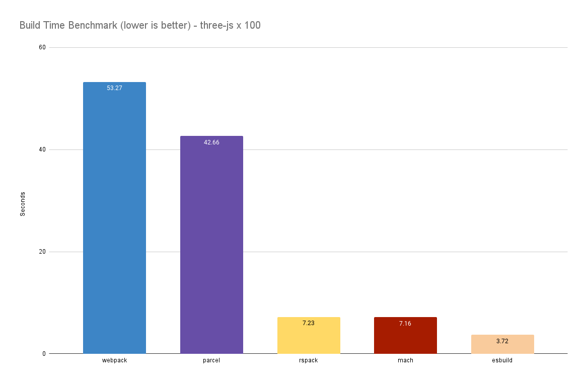

<h1 align="center">🌏️ </img> 🚀</h1>

<h3 align="center">Zero Configuration. Zero Dependencies. Fast AF</h3>

<p align="center">
  </img>
</p>

<p align="center"><i>
  Mach is a super fast multi-threaded bundler written in Rust that puts an emphasis on<br>
  developer experience and the runtime performance of the compiled application.<br>
  <br>
  Mach is heavily inspired by the <a href="https://parceljs.org/">Parcel bundler</a>
</i></p>

<p align="center">
  <a href=".docs/CONTRIBUTING.md">Contributing Guidelines</a>
  .
  <a href="https://github.com/alshdavid/mach/issues">Submit an Issue</a>
  .
  <a href="https://github.com/alshdavid/mach/discussions">Ask a Question</a>
  .
  <a href="BLOG.md">Blog</a>
</p>

<p align="center">
  
  
  
</p>

---

## Installation

You can install Mach from npm or get the latest binary from the github [releases](https://github.com/alshdavid/mach/releases/latest)

```bash
npm install @alshdavid/mach
npx mach version
```

## Usage

```bash
$ mach build ./src/index.html
$ mach dev ./src/index.html #todo
```

## Programmatic Usage

```javascript
import { Mach } from '@alshdavid/mach'

// Create a Mach instance
const mach = new Mach()

// Build a target
const report = await mach.build({
  projectRoot: process.cwd(),
  outFolder: 'dist',
  entries: ['src/index.js']
})
```

## Supported Types

Mach comes preconfigured with sensible defaults and does not need configuration. Mach ships with built-in support for the most common source files in web development.

- TypeScript
- JavaScript
- JSX and TSX
- CSS
- HTML
- Images (todo)

## Plugins

Mach supports plugins that share the ideas and API of [Parcel Plugins](https://parceljs.org/features/plugins) for cases where bundling must be customized.

- [Resolver](https://parceljs.org/plugin-system/resolver/) _partial support_
- [Transformer](https://parceljs.org/plugin-system/transformer/) _partial support_
- [Reporter](https://parceljs.org/plugin-system/reporter/) _todo_
- [Namer](https://parceljs.org/plugin-system/namer/) _todo_

Plugins can be written in:
- [JavaScript](./.docs/PLUGINS_NODEJS.md) _in progress_
- [Rust (Dynamically Loaded)](./.docs/PLUGINS_RUST.md) _todo_
- [Wasm](./.docs/PLUGINS_WASM.md) _todo_

### JavaScript Plugins

Import the plugin API from the `@alshdavid/mach` npm package

```javascript
import { Transformer } from '@alshdavid/mach'
```

## Benchmark

Below is a build of the three-js source code multiplied 100 times and reexported from a single entry point. The benchmark was run on an M1 MacBook Pro with optimizations/minification turned off.

Mach is still under development and has lots of known opportunities for further build time improvements 🙂

<p align="center">
  
</p>

## Remaining work

The goal of Mach 1 will be a super fast production ready bundler with plugin support with some features remaining to be added (for instance - incremental bundling, or caching). 

The order of these may change and some may be pushed back to Mach 2

**🧩 Prerelease [Flyer](https://en.wikipedia.org/wiki/Wright_Flyer)**
- Plugin support
- Minification

**🧩 Prerelease [Red Baron](https://en.wikipedia.org/wiki/Fokker_Dr.I)**
- Source Maps

**🧩 Prerelease [Spitfire](https://en.wikipedia.org/wiki/Supermarine_Spitfire)**
- Watch mode / Auto-recompilation 
- Development server
- Hot reload

**🧩 Prerelease [Mustang](https://en.wikipedia.org/wiki/North_American_P-51_Mustang)**
- Bundle splitting (help wanted 🚩)

**🧩 Prerelease [Shooting Star](https://en.wikipedia.org/wiki/Lockheed_P-80_Shooting_Star)**
- Incremental Bundling for Development

**👀 Release Candidate [X-1](https://en.wikipedia.org/wiki/Bell_X-1)**
- TBD

**🛩️ Mach 1 - Codenamed [Concorde](https://en.wikipedia.org/wiki/Concorde)**
- TBD

## Special Thanks


Mach is heavily inspired by Parcel. It derives learnings, approaches and adapts code directly from the project.<br>
<a href="https://parceljs.org/">Check it out here</a><br>

---


Special thanks to Atlassian for supporting my independent development
of this project during my employment with them.<br>
<a href="https://www.atlassian.com/">Learn about Atlassian</a>

---


Special thanks to the Rust Community Discord, an amazing community of talented engineers who were <br>welcoming and always happy to help out.<br>
<a href="https://github.com/rust-community-discord">Join the Discord Here</a>
