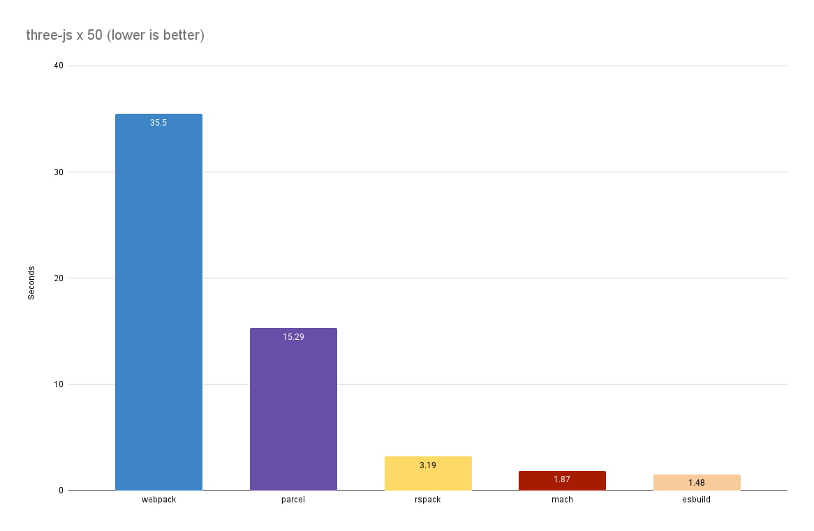

<h1 align="center">🌏️ Mach 🚀 (Alpha Phase)</h1>

<h3 align="center">Zero Configuration Bundler For The Modern Web</h3>

<p align="center"><i>
  Mach is a super fast multi-threaded bundler written in Rust that is<br>
  inspired by the <a href="https://parceljs.org/">Parcel bundler</a> and has zero dependencies.
</i></p>

<p align="center">
  <a href=".docs/CONTRIBUTING.md">Contributing Guidelines</a>
  .
  <a href="https://github.com/alshdavid/mach/issues">Submit an Issue</a>
  .
  <a href="https://github.com/alshdavid/mach/discussions">Ask a Question</a>
</p>

<p align="center">
  
  
  
</p>

---

## Installation

You can install Mach from npm or directly as a [binary](.docs/install.md)

```bash
npm install @alshdavid/mach
npx mach --version
```

## Usage

[Read more here](.docs/usage.md)

#### Simple Build

```bash
$ mach build ./src/index.html
> Build Success

$ ls ./dist
> index.html index.js index.css
```

#### Dev Server

```bash
$ mach dev ./src/index.html
> Serving on http://localhost:4242
```

## Plugins

Plugins are supported by an embedded Deno runtime with support for Node.js, TypeScript, etc
This is still under development

## Benchmark

The benchmark takes the three-js source code, copies it 50 times, imports the 50 copies from a single entrypoint and measures the time to build.

```javascript
import * as copy_1 from './copy_1/Three.js'; window.copy_1 = copy_1;
import * as copy_2 from './copy_2/Three.js'; window.copy_2 = copy_2;
import * as copy_3 from './copy_3/Three.js'; window.copy_3 = copy_3;
// ... and so on
```

The hardware I am using is a desktop AMD 7950x with 16 cores and the builds are using 16 threads.

**29th March 2024**

<p align="center">
  
  <br>
  <i>Build Time (lower is better)</i>
</p>

As of the 29th March 2024, this is a benchmark of Mach verses other bundlers in a "no minify" build. 

There are still a lot of optimizations left here so the numbers are likely to get better as we go 🙂

**Plugins**

The next big push will be completing the Deno integration and completing support for Parcel's JS plugin API.

There is already support for dynamically loaded Rust plugins (incomplete but it's there) but JS plugins are all the rage these days so supporting them is vital.

The cool thing about using Deno is that it supports the Node.js standard library, comes with TypeScript support out of the box and can be embedded. This means plugins can be written in TypeScript, target either the Node.js or Deno runtimes and have minimal overhead when calling into.

Of course, JS plugins will be slower than Rust plugins - but embedding Deno into Mach minimizes the overhead associated with the "bridge" between JS land and Rust land, also allowing me to leverage v8 APIs to share the memory and avoid costly copying.

I intend to support:

- [Resolvers](https://parceljs.org/features/plugins/#resolvers)
- [Transformers](https://parceljs.org/features/plugins/#transformers)
- [Reporters](https://parceljs.org/features/plugins/#reporters)
- [Namers](https://parceljs.org/features/plugins/#namers)

The remaining plugins are cool but I don't want to make them modular without a compelling case, especially at the expense of other features.


## Remaining work

Remaining work and release schedule:

**Pre-release 1 ([Flyer](https://en.wikipedia.org/wiki/Wright_Flyer))**
- Plugin support
- Minification

**Pre-release 2 ([Fokker Dr.I](https://en.wikipedia.org/wiki/Fokker_Dr.I))**
- Source Maps

**Pre-release 3 ([Spitfire](https://en.wikipedia.org/wiki/Supermarine_Spitfire))**
- Watch mode / Auto-recompilation 
- Development server
- Hot reload

**Pre-release 4 ([Mustang](https://en.wikipedia.org/wiki/North_American_P-51_Mustang))**
- Bundle splitting (help wanted 🚩)

**Pre-release 5 ([Shooting Star](https://en.wikipedia.org/wiki/Lockheed_P-80_Shooting_Star))**
- Incremental Bundling for Development

**Beta 1 ([X-1](https://en.wikipedia.org/wiki/Bell_X-1))**
- TBD

**Mach 1 ([Concorde](https://en.wikipedia.org/wiki/Concorde))**
- TBD

## Special Thanks


Mach is heavily inspired by Parcel. It derives learnings, approaches and adapts code directly from the project.<br>
<a href="https://parceljs.org/">Check it out here</a><br>

---


Special thanks to Atlassian for supporting my independent development
of this project during my employment with them.<br>
<a href="https://www.atlassian.com/">Learn about Atlassian</a>

---


Special thanks to the Rust Community Discord, an amazing community of talented engineers who were <br>welcoming and always happy to help out.<br>
<a href="https://github.com/rust-community-discord">Join the Discord Here</a>
