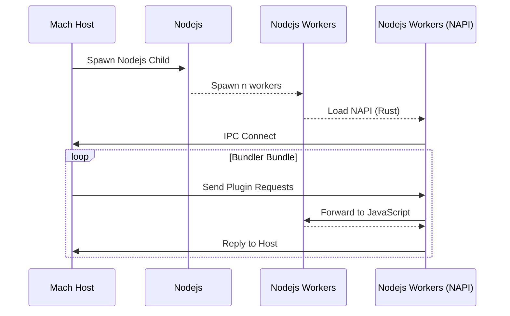

<h1 align="center">🌏️ </img> 🚀 </img></h1>

<h3 align="center">Zero Configuration. Zero Dependencies.</h3>

<p align="center"><i>
  Mach is a super fast multi-threaded bundler written in Rust that puts an emphasis on<br>
  developer experience and the runtime performance of the compiled application.<br>
  <br>
  Mach is heavily inspired by the <a href="https://parceljs.org/">Parcel bundler</a>
</i></p>

<p align="center">
  <a href=".docs/CONTRIBUTING.md">Contributing Guidelines</a>
  .
  <a href="https://github.com/alshdavid/mach/issues">Submit an Issue</a>
  .
  <a href="https://github.com/alshdavid/mach/discussions">Ask a Question</a>
</p>

<p align="center">
  
  
  
</p>

---

## Installation

You can install Mach from npm or directly as a [binary](.docs/install.md)

```bash
npm install @alshdavid/mach
npx mach version
```

## Usage

[Read more here](.docs/usage.md)

```bash
$ mach build ./src/index.html
$ mach dev ./src/index.html
```

## Supported Types

Mach has built-in support for the most common source files.

- [TypeScript](mach/src/platform/plugins/transformer_javascript/transformer.rs)
- [JavaScript](mach/src/platform/plugins/transformer_javascript/transformer.rs)
- [JSX and TSX](mach/src/platform/plugins/transformer_javascript/transformer.rs)
- [CSS](mach/src/platform/plugins/transformer_css/transformer.rs)
- [HTML](mach/src/platform/plugins/transformer_html/transformer.rs)
- Images

## Custom Plugins

Mach supports user-added plugins written in JavaScript or Rust, using the [Parcel Plugin API](https://parceljs.org/features/plugins).

### TypeScript & JavaScript Plugins

_Currently in development_

JavaScript plugins are executed within a separate Nodejs child process. Communication with Nodejs is done using OS-specific inter-process communication APIs (like UNIX domain sockets) and NAPI. This is very low overhead, though sending data across NAPI is slow.

Nodejs plugins will always be relatively slow (see benchmarks) and are best used for prototyping. For performance sensitive builds, it's recommended to use a dynamically loaded native plugin written in Rust (see Rust plugins).

Mach uses the existing Parcel plugin APIs:

- [Resolver](https://parceljs.org/features/plugins/#resolvers) (in progress)
- [Transformer](https://parceljs.org/features/plugins/#transformers) (todo)
- [Reporter](https://parceljs.org/features/plugins/#reporters) (todo)
- [Namer](https://parceljs.org/features/plugins/#namers) (todo)

### Dynamically Loaded Rust Plugins

Mach supports plugins written in Rust that are compiled externally and loaded dynamically. Use the `libmach` crate to get the Plugin API.

This offers a limited subset of the API offered to built-in plugins that are statically compiled into the bundler.

Please raise a PR to include your plugin into Mach if you'd like it to be statically included in the binary.

## Benchmarks

The benchmark takes the three-js source code, copies it 50 times, imports the 50 copies from a single entrypoint and measures the time to build.

```javascript
import * as copy_1 from './copy_1/Three.js'; window.copy_1 = copy_1;
import * as copy_2 from './copy_2/Three.js'; window.copy_2 = copy_2;
import * as copy_3 from './copy_3/Three.js'; window.copy_3 = copy_3;
// ... and so on
```

The hardware I am using is a desktop AMD 7950x with 16 cores and the builds are using 16 threads.


<p align="center">
  
  <br>
  <i>Build Time (lower is better)</i>
</p>

## Blog

**12 May 2024**

**Plugins**

My focus has been on integrating support for Nodejs plugins into the bundler. 

I have been building an inter-process communication bridge that uses OS specific IPC methods. 

My implementation builds on top of the `ipc_channels` crate that wraps the relevant OS APIs and offers a clean `channel` abstraction to use.

This is very low overhead, though JavaScript plugins will still be slow - Benchmarks are coming.

**How it Works**

Mach spawns a Nodejs child process + Nodejs workers that connect to the Mach host process via a native extension that uses NAPI to transfer Rust types to/from the Nodejs context.



Currently I send the entire request over the wire, in future I may decide to make it "transfer on read" for better performance.

I now need to build out the plugin API with the complete types and forwarding/replying for each request.

I intend to support:

- [Resolvers](https://parceljs.org/features/plugins/#resolvers)
- [Transformers](https://parceljs.org/features/plugins/#transformers)
- [Reporters](https://parceljs.org/features/plugins/#reporters)
- [Namers](https://parceljs.org/features/plugins/#namers)

**What Happened to Deno?**

Deno works but is quite hard to integrate without bringing in a lot of undesirable dependencies. 

It is _super_ fast and supports the Nodejs API which is enabled automatically when Deno detects an import from a package in `node_modules`. 

This has a few missing pieces, like it doesn't enable Nodejs support for packages located within a yarn/npm/pnpm workspace (doesn't see `node_modules`).

I will revisit this after I have Nodejs working via IPC. I may look into building Nodejs directly into Mach using `libnode` (though it doesn't have Rust bindings).

...or maybe making a fork of Deno that only supports Nodejs 😆.

**Plugin Adapters**

The current architecture isolates Nodejs support into an "adapter", so it's possible to add support for additional runtimes by adding an adapter to connect to them.

I will look into adding a "libnode" or "Deno" adapter in future.

I plan to add adapters for wasm and native Rust plugins soon.

**Bundle Splitting, Packaging**

More pressing is to rework the graph implementation and build out a bundle splitting implementation (send help).

There are some changes to the packager that are needed to support bundle splitting.

Changing the SWC API to use the `FoldWithMut` will also improve performance of packaging, it's still quite basic at the moment.

## Remaining work

The goal of Mach 1 will be a super fast production ready bundler with plugin support with some features remaining to be added (for instance - incremental bundling, or caching). 

The order of these may change and some may be pushed back to Mach 2

**Alpha 1 - Codenamed [Flyer](https://en.wikipedia.org/wiki/Wright_Flyer)**
- Plugin support
- Minification

**Alpha 2 - Codenamed [Fokker Dr.I](https://en.wikipedia.org/wiki/Fokker_Dr.I)**
- Source Maps

**Alpha 3 - Codenamed [Spitfire](https://en.wikipedia.org/wiki/Supermarine_Spitfire)**
- Watch mode / Auto-recompilation 
- Development server
- Hot reload

**Alpha 4 - Codenamed [Mustang](https://en.wikipedia.org/wiki/North_American_P-51_Mustang)**
- Bundle splitting (help wanted 🚩)

**Alpha 5 - Codenamed [Shooting Star](https://en.wikipedia.org/wiki/Lockheed_P-80_Shooting_Star)**
- Incremental Bundling for Development

**Release Candidate - Codenamed [X-1](https://en.wikipedia.org/wiki/Bell_X-1)**
- TBD

**Mach 1 - Codenamed [Concorde](https://en.wikipedia.org/wiki/Concorde)**
- TBD

## Special Thanks


Mach is heavily inspired by Parcel. It derives learnings, approaches and adapts code directly from the project.<br>
<a href="https://parceljs.org/">Check it out here</a><br>

---


Special thanks to Atlassian for supporting my independent development
of this project during my employment with them.<br>
<a href="https://www.atlassian.com/">Learn about Atlassian</a>

---


Special thanks to the Rust Community Discord, an amazing community of talented engineers who were <br>welcoming and always happy to help out.<br>
<a href="https://github.com/rust-community-discord">Join the Discord Here</a>
