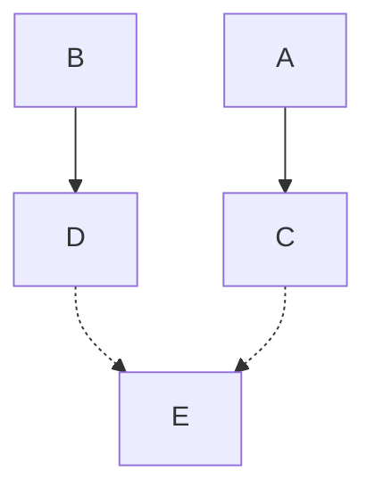
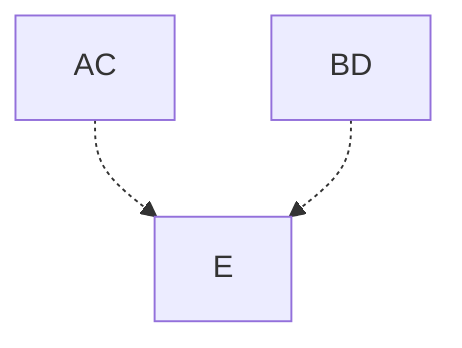
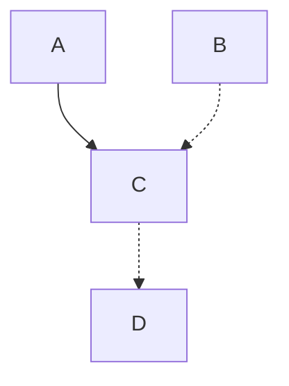
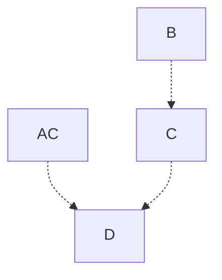
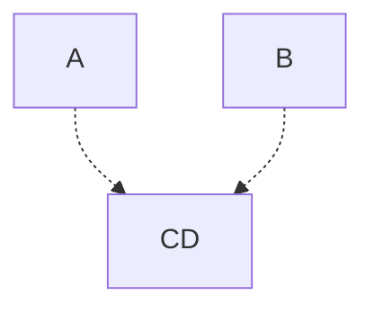
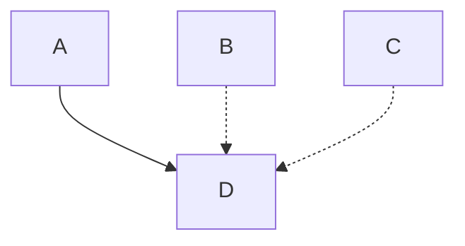
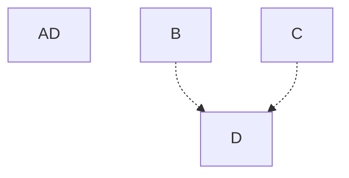
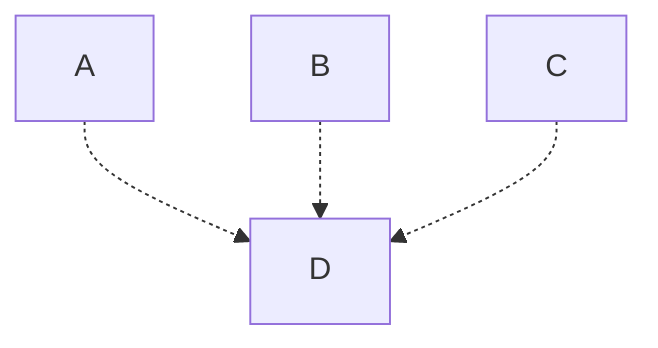
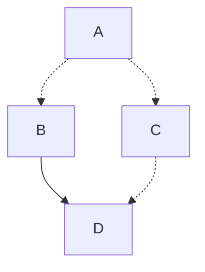
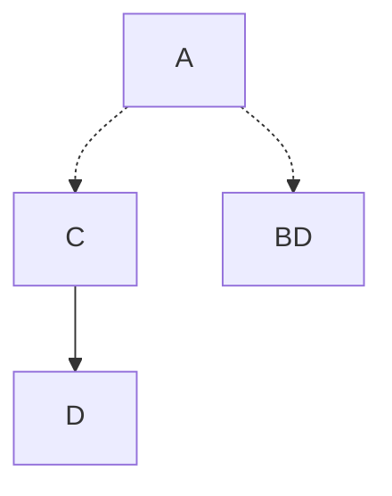

# Bundling Algorithm

## Cases / Examples

## Input

```mermaid
flowchart TD
  A --> C
  D -.-> E
  B --> D
  C -.-> E
```

## Output

```mermaid
flowchart TD
  AC -.-> E
  BD -.-> E
```

## Input

```mermaid
flowchart TD
  A --> C
  B -.-> C
  C -.-> D
```

## Output

```mermaid
flowchart TD
  AC -.-> D
  B -.-> C
  C -.-> D
```

Zero duplication + vendor

```mermaid
flowchart TD
  A -.-> CD
  B -.-> CD
```

## Input

```mermaid
flowchart TD
  A --> D
  B -.-> D
  C -.-> D
```

## Output

```mermaid
flowchart TD
  AD
  B -.-> D
  C -.-> D
```

Zero duplication + vendor

```mermaid
flowchart TD
  A -.-> D
  B -.-> D
  C -.-> D
```

## Input

```mermaid
flowchart TD
  A -.-> B
  A -.-> C
  B -->  D
  C -.-> D
```

Webpack

```mermaid
flowchart TD
  A -.-> C
  A -.-> BD
  C -->  D
```
